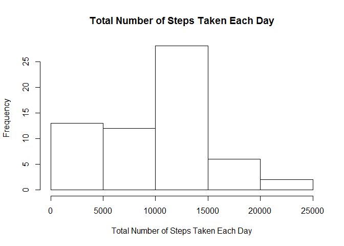
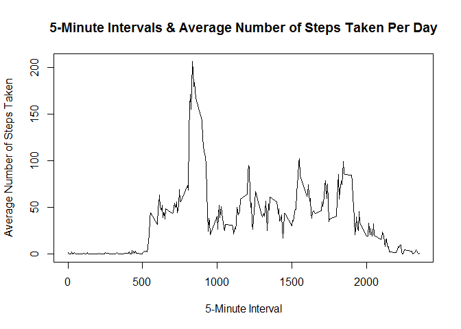
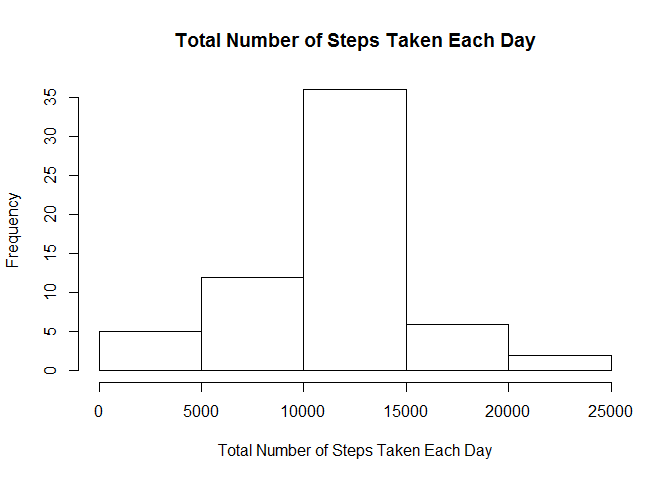
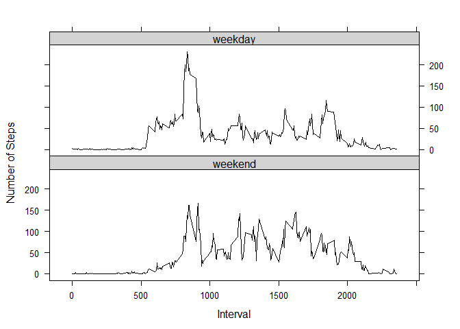

<p align = "justify">This assignment makes use of data from a personal activity monitoring device. This device collects data at 5 minute intervals through out the day. The data consists of two months of data from an anonymous individual collected during the months of October and November, 2012 and include the number of steps taken in 5 minute intervals each day.</p>

##Loading and preprocessing the data

```r
library(dplyr)
```

```
## Warning: package 'dplyr' was built under R version 3.4.2
```

```
## 
## Attaching package: 'dplyr'
```

```
## The following objects are masked from 'package:lubridate':
## 
##     intersect, setdiff, union
```

```
## The following objects are masked from 'package:stats':
## 
##     filter, lag
```

```
## The following objects are masked from 'package:base':
## 
##     intersect, setdiff, setequal, union
```

```r
data <- read.csv("activity.csv", header = TRUE, comment.char= "")
data$steps <- as.numeric(data$steps)
```

##Q1: What is mean total number of steps taken per day?

<p>1a: Calculate the total number of steps taken per day</p>


```r
q1 <- data %>% group_by(date) %>% summarise(total = sum(steps ,na.rm=TRUE))
```

<p>1b: Make a histogram of the total number of steps taken each day</p>


```r
hist(q1$total, main = "Total Number of Steps Taken Each Day", xlab = "Total Number of Steps Taken Each Day")
```

<!-- -->

<p>1c: Calculate and report the mean and median of the total number of steps taken per day</p>


```r
mean(q1$total)
```

```
## [1] 9354.23
```

```r
median(q1$total)
```

```
## [1] 10395
```

<p>Answer for 1c: The mean is 9354 steps and median is 10395 steps.</p>

##Q2: What is the average daily activity pattern?

<p align = "justify">2a: Make a time series plot (i.e. type = "l") of the 5-minute interval (x-axis) and the average number of steps taken, averaged across all days (y-axis)</p>


```r
q2 <- data %>% group_by(interval) %>% summarise(average = mean(steps, na.rm = TRUE))
plot(x = q2$interval, y = q2$average, type = "l", main = "5-Minute Intervals & Average Number of Steps Taken Per Day", xlab = "5-Minute Interval", ylab = "Average Number of Steps Taken")
```

<!-- -->

<p align = "justify">2b: Which 5-minute interval, on average across all the days in the dataset, contains the maximum number of steps?</p>


```r
q2[which(q2$average == max(q2$average)), ]
```

```
## # A tibble: 1 x 2
##   interval  average
##      <int>    <dbl>
## 1      835 206.1698
```

<p align = "justify">Answer for 2b: The 5-minute interval starting from 0835H contains the maximum number of steps.</p>

##Q3: Imputing missing values

<p align = "justify">3a: Calculate and report the total number of missing values in the dataset (i.e. the total number of rows with NAs)</p>


```r
sum(is.na(data$steps) == TRUE)
```

```
## [1] 2304
```

<p>Answer for 3a: The total number of missing values in the dataset is 2304.</p>

<p align = "justify">3b: Devise a strategy for filling in all of the missing values in the dataset. The strategy does not need to be sophisticated. For example, you could use the mean/median for that day, or the mean for that 5-minute interval, etc. Create a new dataset that is equal to the original dataset but with the missing data filled in.</p>


```r
no_missing_data <- data
no_missing_data$steps[is.na(no_missing_data$steps == TRUE)] <- q2$average[match(q2$interval, no_missing_data$interval)]
```

<p align = "justify">Answer for 3b: A new dataset named no_missing_data is created. It is the original dataset with missing data filled in, whereby mean for the interval will be used wherever data is missing.</p>

<p>3c: Make a histogram of the total number of steps taken each day.</p>


```r
q3 <- no_missing_data %>% group_by(date) %>% summarise(total = sum(steps, na.rm = TRUE))
hist(q3$total, main = "Total Number of Steps Taken Each Day", xlab = "Total Number of Steps Taken Each Day")
```

<!-- -->

<p align = "justify">3d: Calculate and report the mean and median total number of steps taken per day. Do these values differ from the estimates from the first part of the assignment? What is the impact of imputing missing data on the estimates of the total daily number of steps?</p>


```r
mean(q3$total)
```

```
## [1] 10766.19
```

```r
median(q3$total)
```

```
## [1] 10766.19
```

<p align = "justify">Answer for 3d: The mean and median recomputed after imputing missing data happened to be the same at 10766 steps per day. The recomputed mean and median are higher than mean and median computed previously.</p>

##Q4: Are there differences in activity patterns between weekdays and weekends?

<p align = "justify">4a: Create a new factor variable in the dataset with two levels - "weekday" and "weekend" indicating whether a given date is a weekday or weekend day.</p>


```r
wd_we_data<- no_missing_data
wd_we_data$date <- as.Date(wd_we_data$date, "%Y-%m-%d")
weekdayslist <- c('Monday', 'Tuesday', 'Wednesday', 'Thursday', 'Friday')
wd_we_data$day <- factor((weekdays(wd_we_data$date) %in% weekdayslist),levels=c(FALSE, TRUE), labels=c('weekend', 'weekday'))
```

<p align = "justify">4b: Make a panel plot containing a time series plot (i.e. type = "l") of the 5-minute interval (x-axis) and the average number of steps taken, averaged across all weekday days or weekend days (y-axis).</p>


```r
q4 <- wd_we_data %>% group_by(day, interval) %>% summarise(average = mean(steps, na.rm = TRUE))
library(lattice)
xyplot(average~ interval | day, data = q4, layout = c(1,2), col="black", ylab = "Number of Steps", xlab = "Interval", type = "l",par.settings = list(strip.background=list(col="lightgrey")))
```

<!-- -->

<p align = "justify">Answer for 4b: There were more activities in the early mornings (5am-8am) of weekdays than weekends. There were more activities in the afternoons (12nn-5pm) of weekends than weekdays.</p>

